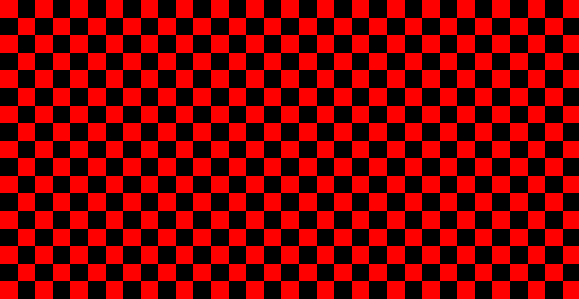

# leaf-venation

This is a simple Wayland client application written in Rust. It demonstrates how to create a window and draw into it using the Wayland protocol.

## Screenshots

Here are some screenshots of the application in action.


## File Structure

```
.
├── .gitignore
├── Cargo.lock
├── Cargo.toml
├── LICENSE
├── README.md
├── images/
│   └── ...
└── src
    ├── main.rs
    ├── shapes
    │   ├── circle.rs
    │   └── mod.rs
    ├── types.rs
    └── window.rs
```

## Building and Running

To build the project, you need to have Rust and Cargo installed.

```bash
cargo build --release
```

To run the application:

```bash
cargo run
```

This must be run from within a Wayland session.

## References

This project was created with the help of the following resources.

- [Deciphering Academic Slop](https://www.youtube.com/watch?v=Gu_L8MPvGJM)
- [Modeling Trees with a Space Colonization Algorithm](https://www.algorithmicbotany.org/papers/colonization.egwnp2007.pdf)
- [Reference Implementation](https://github.com/DaniGodin/LeafModeling)
